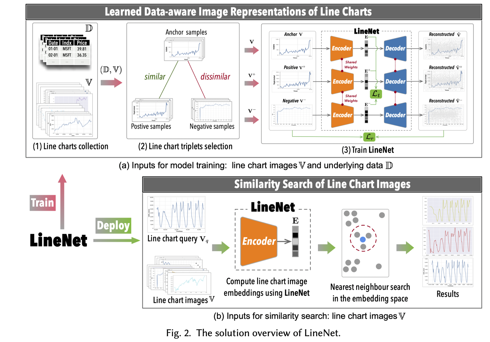

# LineNet

Finding line-chart images similar to a given line-chart image query is a common task in data exploration and image query systems. We study the scenario that during query time, only line-chart images are available. Our goal is to train a neural network that can turn these line-chart images into representations that are aware of the data used to generate these line charts, so as to learn better representations.
Our key idea is that we can collect both data and line-chart images to learn such a neural network (at training step), while during query (or inference) time, we support the case that only line-chart images are provided.




To this end, we present <b>LineNet</b>, <i>a Vision Transformer-based Triplet Autoencoder model</i>, to learn data-aware image representations of line charts for similarity search.

LineNet is built using a Triplet Autoencoder architecture, which consists of three identical autoencoders. For each autoencoder, it consists of an Encoder and a symmetric Decoder. At the training phase, LineNet takes as input a line chart image triplet $(V, V^+ , V^−)$, which is comprised of an anchor, a positive (i.e., similar), and a negative (i.e., dissimilar) line chart image. We compute $\mathbf{dist}(·, ·)$ based on their underlying data D to generate triplets, which indicates their data similarity.

## Train LineNet

We first propose a triplets selection algorithm to automatically select a set of training samples (i.e., a set of triplets). This algorithm can produce a larger number of effective training samples for training LineNet.

Furthermore, we judiciously select a small set of most representative triplets to make the learning process more effective and efficient. Therefore, we further design a diversified triplets selection algorithm to pick a set of discriminative triplets from a mini-batch to optimize the learning process.


## Deploy LineNet

Suppose we have a well-trained \sys that can map a line chart image $\mathbf{V}$ to an  embedding vector $\mathbf{E}$ in the embedding space. Naturally, we can use the squared Euclidean distance between $\mathbf{E}_i$ and $\mathbf{E}_j$ in the embedding space to compute the similarity between line charts $\mathbf{V}_i$ and $\mathbf{V}_j$, which is defined as:~$\dist(\mathcal{F}(\mathbf{V}_i), \mathcal{F}(\mathbf{V}_j)) = \dist(\mathbf{E}_i, \mathbf{E}_j) = ||\mathbf{E}_i - \mathbf{E}_j||_2^2$.

Therefore, once the embedding space is well-prepared, the top-$k$ similarity search of line chart images problem can be  tackled using $k$ nearest neighbor search algorithms in the embedding space.

Please refer to our [paper](https://luoyuyu.vip/files/SIGMOD2023-LineNet.pdf) at SIGMOD 2023 for more details.


# Running Code

Please refer to the folder **LineNet** for details.


# Citing ncNet

```bibTeX
@article{10.1145/3588942,
author = {Luo, Yuyu and Zhou, Yihui and Tang, Nan and Li, Guoliang and Chai, Chengliang and Shen, Leixian},
title = {Learned Data-Aware Image Representations of Line Charts for Similarity Search},
year = {2023},
issue_date = {May 2023},
publisher = {Association for Computing Machinery},
address = {New York, NY, USA},
volume = {1},
number = {1},
url = {https://doi.org/10.1145/3588942},
doi = {10.1145/3588942},
journal = {Proc. ACM Manag. Data},
month = {may},
articleno = {88},
numpages = {29},
keywords = {similarity search, line charts, triplets selection, learned representations}
}
```

# Contact
If you have any questions, feel free contact Yuyu Luo (luoyy18 [AT] mails.tsinghua.edu.cn).
